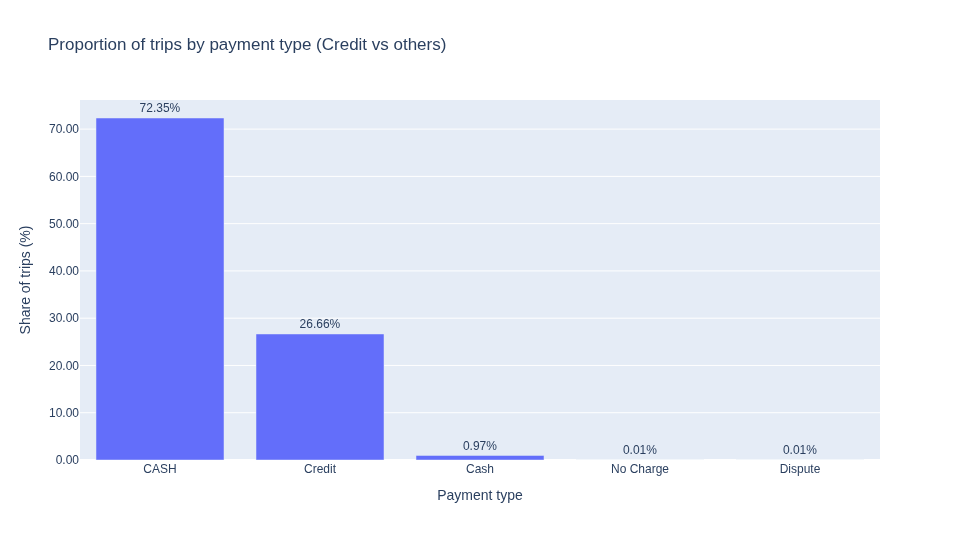

# dlt Workshop Homework

## Setup and Data Loading 

Run the pipeline and ingest data into DuckDB by executing the commands:

```sh
cd taxi-pipeline/

uv sync --locked
uv run taxi_pipeline.py
```

## Analyses

Once the pipeline had run, the queries were executed by asking the **Cursor** 
agent to answer the questions through the **dlt MCP Server** configured in the 
IDE.

The prompt used was:

> Use the dlt MCP server to run the following query:

**Question 1: What is the start date and end date of the dataset?**

```
pipeline_name taxi_pipeline
sql_select_query SELECT MIN(trip_pickup_date_time) AS start_date, MAX(trip_pickup_date_time) AS end_date FROM taxi_data.taxi_trips
```

Here are the results from the dlt MCP server:

**Start date and end date of the dataset**
- Start date: 2009-06-01 11:33:00 UTC
- End date: 2009-06-30 23:58:00 UTC

**Question 2: What proportion of trips are paid with credit card?**

```
pipeline_name taxi_pipeline
sql_select_query SELECT payment_type, COUNT(*) AS trips, ROUND(100.0 * COUNT(*) / SUM(COUNT(*)) OVER (), 2) AS pct FROM taxi_data.taxi_trips GROUP BY payment_type ORDER BY trips DESC
```

Proportion of trips paid with credit card

|Payment type |  Trips  |    %   |
|:------------|--------:|-------:|
| CASH        |   7,235	| 72.35% |
| Credit      |   2,666	| 26.66% |
| Cash        |      97 |  0.97% |
| No Charge   |       1 |  0.01% |
| Dispute     |       1 |  0.01% |

So, **26.66%** of trips are paid with credit card.

A **marimo** chart for this query can be generated by running:

```shell
uv run marimo run credit_card_share.py
```

The resulting report is:



**Question 3: What is the total amount of money generated in tips?**

```
pipeline_name taxi_pipeline
sql_select_query SELECT SUM(tip_amt) AS total_tips FROM taxi_data.taxi_trips
```

**Total amount of money from tips:** $6,063.41
